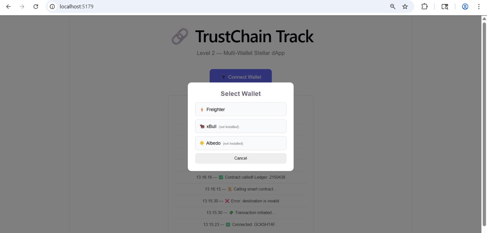
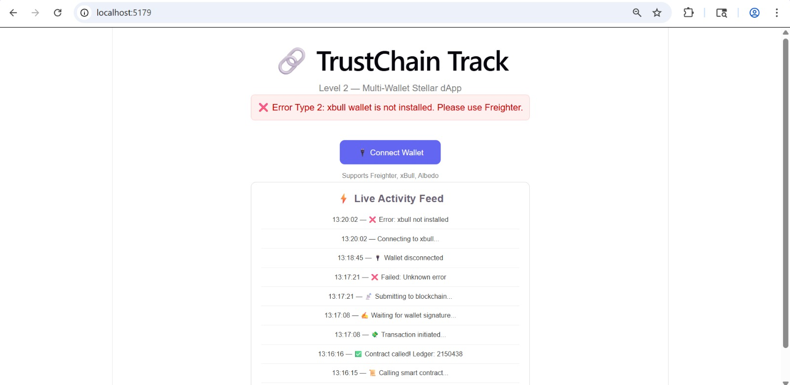
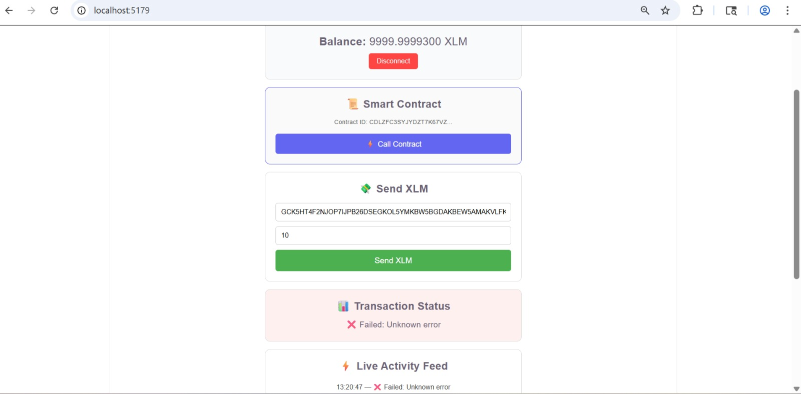
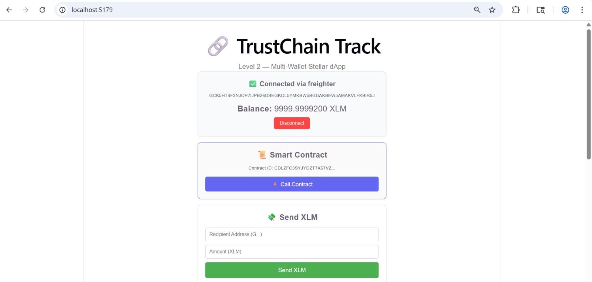
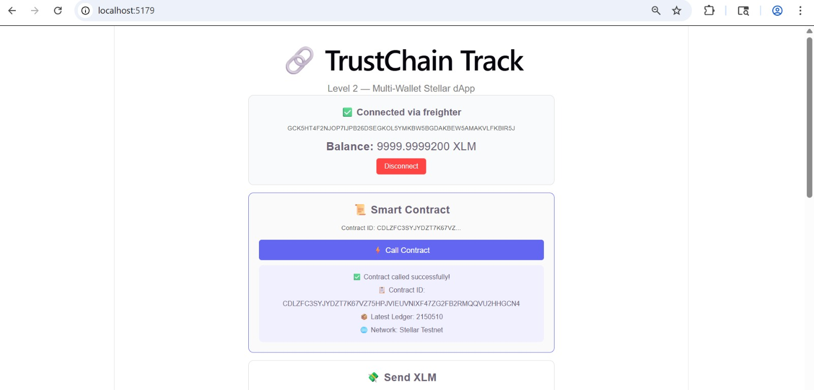
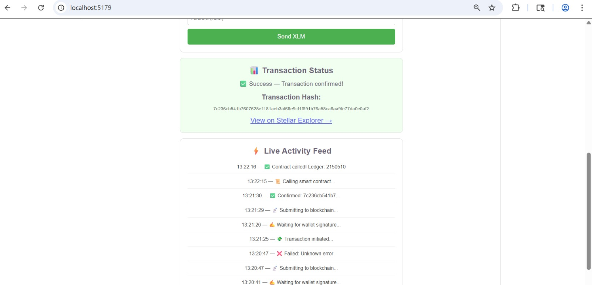

# TrustChain Track 🔗

A multi-wallet Stellar dApp with smart contract integration built for Level 2.

## 🌐 Live Demo
👉 https://trustchain-track.vercel.app

## 📌 Project Description
TrustChain Track is an upgraded Stellar blockchain dApp that supports multiple wallets, handles 3 error types, integrates a smart contract, and provides real-time transaction tracking with a live activity feed.

## 🛠️ Tech Stack
- React + Vite
- Stellar SDK
- Freighter Wallet API
- Stellar Testnet (Horizon)
- Soroban RPC (Smart Contract)

## ✨ Features
- Multi-wallet support (Freighter, xBull, Albedo)
- 3 error types handled
- Smart contract integration
- Real-time XLM balance
- Send XLM transactions
- Transaction status (⏳ Pending → ✅ Success → ❌ Failed)
- Transaction hash + Stellar Explorer link
- Live Activity Feed
- Disconnect wallet

## ⚠️ Error Handling
- Error Type 1: Account not found on testnet
- Error Type 2: Wallet extension not installed
- Error Type 3: User rejected wallet connection

## 📜 Smart Contract
- Contract ID: CDLZFC3SYJYDZT7K67VZ75HPJVIEUVNIXF47ZG2FB2RMQQVU2HHGCN4
- Network: Stellar Testnet
- Called from frontend via Soroban RPC

## 🚀 Setup Instructions

1. Clone the repository:
   git clone https://github.com/Pritty05/trustchain-track.git

2. Install dependencies:
   cd trustchain-track
   npm install

3. Run the app:
   npm run dev

4. Open browser at http://localhost:5173

## 📋 Requirements
- Freighter Wallet browser extension installed
- Freighter set to Testnet network

## 📸 Screenshots

### 1. Wallet Options

### 2. Error Handling

### 3. Error Rejected

### 4. Wallet Connected

### 5. Smart Contract Called

### 6. Transaction Success

## 🔗 Testnet Transaction Proof
View on Stellar Explorer:
https://stellar.expert/explorer/testnet